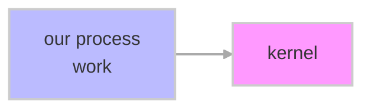
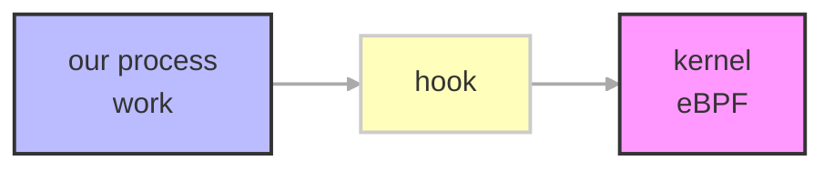
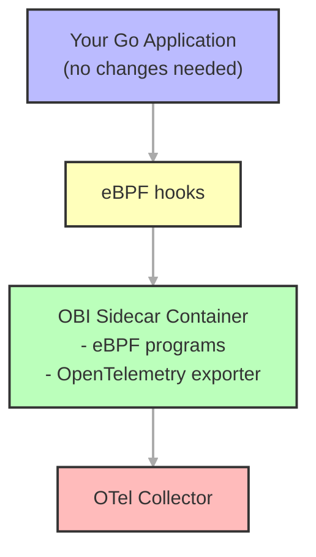
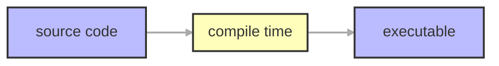
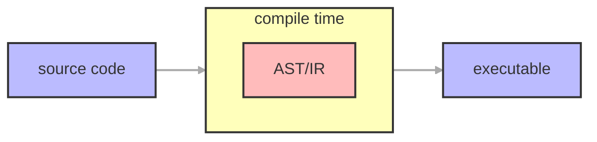
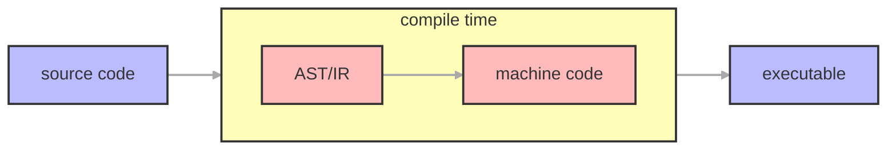
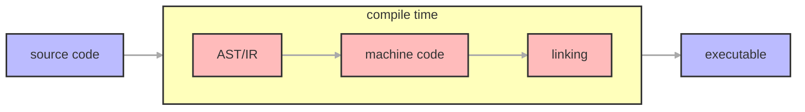
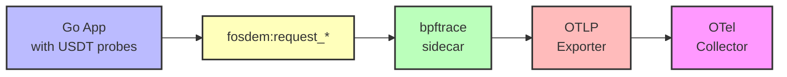

<!-- _class: vcenter invert -->

# How to Instrument Go Without Changing a Single Line of Code

Hannah Kim, Kemal Akkoyun

FOSDEM 2026

---

<!-- _class: vcenter invert -->

# WHY do we care?

---

<!-- _class: vcenter -->

# The Observability Promise

<div class="columns">

<div>

**What we want:**

* Understand system behavior
* Debug production issues fast
* Prevent outages before they happen

</div>

<div>

**What we get:**

* Distributed complexity
* Partial visibility
* "It works on my machine"

</div>

</div>

---

<!-- _class: vcenter -->

# The Instrumentation Tax

Every new service requires:

* Import the SDK
* Initialize the tracer
* Wrap every handler
* Propagate context everywhere
* Handle shutdown gracefully

**Multiply by 100 microservices...**

---

<!-- _class: vcenter -->

# A Hook-Up Story

Where instrumentation gets in the way:

* **Vendor lock-in**: Committed to one APM? Good luck switching
* **Code pollution**: Business logic buried under telemetry
* **Inconsistent coverage**: Some services instrumented, some not
* **Performance anxiety**: "Is this span worth the overhead?"

---

<!-- _class: vcenter -->

# The Dream

**What if we could have observability without changing code?**

* No SDK imports
* No wrapper functions
* No context propagation boilerplate
* Just... observability

---

<!-- _class: vcenter invert -->

# What is instrumentation?

---

<!-- _class: vcenter -->

<div class="vcenter">

<div style="text-align: center;">

## your application

<div class="hidden">

### ???

### ???

</div>

</div>

</div>

---

<!-- _class: vcenter -->

<div class="vcenter">

<div style="text-align: center;">

## your application → your backend

<div class="hidden">

### ???

### ???

</div>

</div>

</div>

---

<!-- _class: vcenter -->

<div class="vcenter">

<div style="text-align: center;">

## your application → your backend

### ???

### ???

</div>

</div>

---

<!-- _class: vcenter -->

<div class="columns">

<div>

## your application → your backend

### ???

### ???

</div>

<div>

### **LOGS**

(what happened)

<div class="hidden">

### **METRICS**

(how much/fast things happened)

### **TRACES**

(how things happened)

</div>

</div>

---

<!-- _class: vcenter -->

<div class="columns">

<div>

## your application → your backend

### ???

### ???

</div>

<div>

### **LOGS**

(what happened)

### **METRICS**

(how much/fast things happened)

<div class="hidden">

### **TRACES**

(how things happened)

</div>

</div>

---

<!-- _class: vcenter -->

<div class="columns">

<div>

## your application → your backend

### ???

### ???

</div>

<div>

### **LOGS**

(what happened)

### **METRICS**

(how much/fast things happened)

### **TRACES**

(how things happened)

</div>

---

<!-- paginate: true -->

<!-- _class: vcenter invert -->

# WHAT IS AUTO-INSTRUMENTATION? 🤔

---

<!-- _class: vcenter -->

# What is auto-instrumentation?

1) I want to know more about my code
2) I need to instrument it, but I'm too lazy to do it myself
3) ???

<div class="hidden">

<span class="big">Profit 💸💸💸</span>

</div>

---

<!-- _class: vcenter -->

# What is auto-instrumentation?

1. I want to know more about my code
2. I need to instrument it, but I'm too lazy to do it myself
3. ???

<span class="big">Profit 💸💸💸</span>

---

<!-- _class: vcenter -->

# What is auto-instrumentation?

<div class="columns">

<div class="hidden">

### RUN TIME

- Happens at runtime
- Sometimes causes source code changes
- Meh with compiler languages like Go

</div>

<div class="hidden">

### COMPILE TIME

- Happens at... compile time
- (Before run time)
- Works great with compiler languages like Go

</div>

</div>

<br>
<br>
<br>

**auto-instrumentation**: instrumenting your code (collecting signals + data) without manual code changes

---

<!-- _class: vcenter -->

# What is auto-instrumentation?

<div class="columns">

<div>

### RUN TIME

- Happens at runtime (surprised???)
- Sometimes causes source code changes
- Meh with compiled languages like Go, C++, etc.

</div>

<div class="hidden">

### COMPILE TIME

- Happens at... compile time
- (Before run time)
- Works great with compiled languages like Go, C++, etc.

</div>

</div>

<br>
<br>

**auto-instrumentation**: instrumenting your code (collecting signals + data) without manual code changes

---

<!-- _class: vcenter -->

# What is auto-instrumentation?

<div class="columns">

<div>

### RUN TIME

- Happens at runtime (surprised???)
- Sometimes causes source code changes
- Meh with compiler languages like Go

</div>

<div>

### COMPILE TIME

- Happens at... compile time
- (Before run time)
- Works great with compiler languages like Go

</div>

</div>

<br>
<br>

**auto-instrumentation**: instrumenting your code (collecting signals + data) without manual code changes

---

<!-- _class: vcenter -->

# Runtime Approaches

* **eBPF**: extended Berkeley packet filter
    * `uprobe` hooks
    * `kprobe` hooks
    * `USDT` (Userland Statically Defined Tracing) hooks

* **Library injection (LD_PRELOAD)**

---

<!-- _class: vcenter -->
<!-- footer: "**eBPF**: extended Berkeley packet filter" -->

# How eBPF Works



---

<!-- _class: vcenter -->

# How eBPF Works



---

<!-- _class: vcenter invert -->

# OpenTelemetry eBPF Instrumentation (OBI)

---

<!-- _class: vcenter -->

# What is OBI?

<div class="columns">

<div class="hidden">

**OBI** (OpenTelemetry eBPF Instrumentation) is a runtime instrumentation approach that:

- Uses eBPF to hook into Go runtime
- Extracts telemetry without code modification
- Part of OpenTelemetry ecosystem
- Production-ready and vendor-neutral
- Requires administrative privileges (root access)

</div>

<div class="hidden">



</div>

</div>

---

<!-- _class: vcenter -->

# What is OBI?

<div class="columns">

<div>

**OBI** (OpenTelemetry eBPF Instrumentation) is a runtime instrumentation approach that:

- Uses eBPF to hook into Go runtime
- Extracts telemetry without code modification
- Part of OpenTelemetry ecosystem
- Production-ready and vendor-neutral
- Requires administrative privileges (root access)

</div>

<div class="hidden">


</div>

</div>

---

<!-- _class: vcenter -->

# What is OBI?

<div class="columns">

<div>

**OBI** (OpenTelemetry eBPF Instrumentation) is a runtime instrumentation approach that:

- Uses eBPF to hook into Go runtime
- Extracts telemetry without code modification
- Part of OpenTelemetry ecosystem
- Production-ready and vendor-neutral
- Requires administrative privileges (root access)

</div>

<div>


</div>

</div>

---

<!-- _class: vcenter -->

# OBI Configuration

```yaml
# obi-config.yaml
open_port: 8080
service:
    name: fosdem-obi
log_level: debug

otel_traces_export:
    endpoint: http://otel-collector:4318

prometheus_export:
    port: 9090
    path: /metrics

meter_provider:
    features:
        - application
```

---

<!-- _class: vcenter -->
<!-- footer: "" -->

# Compile Time Approaches

<div>

* OpenTelemetry Compile Time Instrumentation SIG
* Datadog Orchestrion

</div>

---

<!-- _class: vcenter -->
<!-- footer: "Compile Time" -->

# Compile Time Flow



<div class="hidden">

```bash
go run -toolexec 'orchestrion toolexec' .
```

**AST**: abstract syntax tree
**IR**: intermediate representation

</div>

---

<!-- _class: vcenter -->

# Compile Time Flow



<div class="hidden">

```bash
go run -toolexec 'orchestrion toolexec' .
```

</div>

**AST**: abstract syntax tree
**IR**: intermediate representation

---

<!-- _class: vcenter -->

# Compile Time Flow



<div class="hidden">

```bash
go run -toolexec 'orchestrion toolexec' .
```

</div>

**AST**: abstract syntax tree
**IR**: intermediate representation

---

<!-- _class: vcenter -->

# Compile Time Flow



<div class="hidden">

```bash
go run -toolexec 'orchestrion toolexec' .
```

</div>

**AST**: abstract syntax tree
**IR**: intermediate representation

---

<!-- _class: vcenter -->

# Compile Time Flow


<div>

```bash
go run -toolexec 'orchestrion toolexec' .
```

</div>

**AST**: abstract syntax tree
**IR**: intermediate representation

---

<!-- _class: vcenter -->

# What is Orchestrion?

**Orchestrion** is a compile-time instrumentation approach that:

* Traces the AST created during compile time
* Injects Datadog instrumentation at specific nodes
* Updates executable file without source code changes
* Can be configured to add/remove instrumentation
* Compatible with OpenTelemetry

---

<!-- _class: vcenter -->

# Orchestrion Configuration

```yaml
# orchestrion.yaml
aspects:
    - id: make spans
      join-point:
          all-of:
              - package-name: main
              - function-body:
                    function:
                        - name: main
      advice:
          - prepend-statements:
                imports:
                    otel: go.opentelemetry.io/otel
                    context: context
                template: |-
                    tracer := otel.Tracer()
                    _, span := tracer.Start(context.Background, "orchestrion.handler")
```

---

<!-- _class: vcenter invert -->

# How Does Each Approach Work?

---

<!-- _class: vcenter -->

# Manual Instrumentation (Before)

```go
func handleRequest(w http.ResponseWriter, r *http.Request) {
    // Just business logic
    result := processData(r.Body)
    json.NewEncoder(w).Encode(result)
}
```

---

<!-- _class: vcenter -->

# Manual Instrumentation (After)

```go
func handleRequest(w http.ResponseWriter, r *http.Request) {
    ctx, span := tracer.Start(r.Context(), "handleRequest")
    defer span.End()

    span.SetAttributes(
        attribute.String("http.method", r.Method),
        attribute.String("http.url", r.URL.Path),
    )

    result := processData(ctx, r.Body)
    json.NewEncoder(w).Encode(result)
}
```

**+15 lines per handler**

---

<!-- _class: vcenter -->

# eBPF Auto-Instrumentation

```yaml
# No code changes - just deploy a sidecar
apiVersion: v1
kind: Pod
spec:
  containers:
    - name: app
      image: myapp:latest
    - name: otel-auto
      image: otel/autoinstrumentation-go:latest
      securityContext:
        privileged: true  # Required for eBPF
```

**Hooks into Go runtime via uprobes**

---

<!-- _class: vcenter -->

# OBI (OpenTelemetry eBPF Instrumentation)

```bash
# Run alongside your application
docker run --privileged \
  --pid=container:myapp \
  -e OTEL_EXPORTER_OTLP_ENDPOINT=http://collector:4318 \
  otel/ebpf-instrumentation:latest
```

**Attaches to running process - no restart needed**

---

<!-- _class: vcenter -->

# Orchestrion (Compile-Time)

```bash
# Build with instrumentation injected
go build -toolexec 'orchestrion toolexec' -o myapp .

# Or
orchestrion go build -o myapp .
```

**AST transformation during compilation**

---

<!-- _class: vcenter invert -->

# Benchmarking

---

<!-- _class: vcenter -->
<!-- footer: "" -->

# Methodology

* **Environment**: Docker-based observability stack
* **Load Generator**: Archetypes (idle, throughput, latency, enterprise)
* **Metrics**: CPU, Memory, Latency (p50/p95/p99), Error rate
* **Application**: Same Go HTTP server across all scenarios

> Detailed methodology in our FOSDEM Software Performance Devroom talk

---

<!-- _class: vcenter -->

# Scenarios Tested

1. **Default** - No instrumentation (baseline)
2. **Manual** - OpenTelemetry SDK with explicit spans
3. **OBI** - OpenTelemetry eBPF Instrumentation
4. **eBPF Auto** - OTel Auto-Instrumentation
5. **Orchestrion** - Compile-time code injection (OTel SDK)

---

<!-- _class: vcenter -->

# Environment Setup

* Docker Compose stack with:
    * Go application container
    * OTel Collector
    * Jaeger (traces)
    * Prometheus (metrics)

* Identical hardware allocation per scenario
* 5-minute sustained load tests

---

<!-- _class: vcenter invert -->

# How do they compare?

---

<!-- _class: vcenter -->

# How do they compare?

TODO(Hannah): insert screenshots from Datadog dashboard

---

<!-- _class: vcenter -->

<div class="centered-table">

| Approach           | CPU | Memory | # Errors |
| ------------------ | --- | ------ | -------- |
| Manual             |     |        |          |
| Auto (eBPF)        |     |        |          |
| Auto (OBI)         |     |        |          |
| Auto (Orchestrion) |     |        |          |

</div>

```bash
TODO(hannah): add numbers +/- to table above, add more columns as necessary
```

---

<!-- _class: vcenter invert -->

# Who wins?

---

<!-- _class: vcenter -->

# Comparison Matrix

<div class="centered-table">

| Approach           | Performance | Stability | Security | Portability |
| ------------------ | ----------- | --------- | -------- | ----------- |
| Auto (eBPF)        |             |           |          |             |
| Auto (OBI)         |             |           |          |             |
| Auto (Orchestrion) |             |           |          |             |

</div>

---

<!-- _class: vcenter -->

# Comparison Matrix

<div class="centered-table">

| Approach           | Performance | Stability | Security | Portability |
| ------------------ | ----------- | --------- | -------- | ----------- |
| Auto (eBPF)        | ⚠           |           |          |             |
| Auto (OBI)         | ⚠           |           |          |             |
| Auto (Orchestrion) | ⚠           |           |          |             |

</div>

---

<!-- _class: vcenter -->

# Comparison Matrix

<div class="centered-table">

| Approach           | Performance | Stability | Security | Portability |
| ------------------ | ----------- | --------- | -------- | ----------- |
| Auto (eBPF)        | ⚠           | ⚠         |          |             |
| Auto (OBI)         | ⚠           | ⚠         |          |             |
| Auto (Orchestrion) | ⚠           | ✅        |          |             |

</div>

---

<!-- _class: vcenter -->

# Comparison Matrix

<div class="centered-table">

| Approach           | Performance | Stability | Security | Portability |
| ------------------ | ----------- | --------- | -------- | ----------- |
| Auto (eBPF)        | ⚠           | ⚠         | ⚠        |             |
| Auto (OBI)         | ⚠           | ⚠         | ⚠        |             |
| Auto (Orchestrion) | ⚠           | ✅        | ✅       |             |

</div>

---

<!-- _class: vcenter -->

# Comparison Matrix

<div class="centered-table">

| Approach           | Performance | Stability | Security | Portability |
| ------------------ | ----------- | --------- | -------- | ----------- |
| Auto (eBPF)        | ⚠           | ⚠         | ⚠        | ⚠           |
| Auto (OBI)         | ⚠           | ⚠         | ⚠        | ⚠           |
| Auto (Orchestrion) | ⚠           | ✅        | ✅       | ✅          |

</div>

---

<!-- _class: vcenter -->

# The Winner?

<div class="centered-table">

| Approach           | Performance | Stability | Security | Portability |
| ------------------ | ----------- | --------- | -------- | ----------- |
| Auto (eBPF)        | ⚠           | ⚠         | ⚠        | ⚠           |
| Auto (OBI)         | ⚠           | ⚠         | ⚠        | ⚠           |
| Auto (Orchestrion) | ⚠           | ✅        | ✅       | ✅          |

</div>

**It depends on your use case!**

eBPF/OBI: Great for <span class="hl">runtime flexibility</span>
Orchestrion: Great for <span class="hl">stability and security</span>

---

<!-- _class: vcenter invert -->

# The Future: Proof of Concepts

---

<!-- _class: vcenter -->

# PoC: USDT + eBPF

**User Statically-Defined Tracing**

```go
// Compile-time probes - zero overhead when disabled
probe.Fire("fosdem:request_start", requestID, timestamp)
// ... handle request ...
probe.Fire("fosdem:request_end", requestID, timestamp, duration)
```

* Uses `salp` library (Go bindings to libstapsdt)
* Attached dynamically via bpftrace sidecar
* **Zero runtime cost** when not tracing

---

<!-- _class: vcenter -->

# PoC: USDT Architecture



---

<!-- _class: vcenter -->

# PoC: Frida Dynamic Instrumentation

**Runtime function hooking**

```javascript
// hook.js - Attach to running Go binary
Interceptor.attach(Module.findExportByName(null, "net/http.serverHandler.ServeHTTP"), {
    onEnter: function(args) {
        // Extract request info from Go structs
        send({ method: readGoString(args[1]), path: readGoString(args[2]) });
    }
});
```

* No code changes, no recompilation
* Works with **any existing binary**
* JavaScript hooks + Python OTLP bridge

---

<!-- _class: vcenter -->

# PoC: Flight Recording (Future Vision)

**Continuous profiling with JFR-style recording**

* Always-on, low-overhead tracing
* Circular buffer of recent events
* "What happened in the last 5 minutes?"
* Retroactive debugging without reproduction

**Inspired by Java Flight Recorder**

---

<!-- _class: vcenter invert -->

# Final thoughts

1) Instrumentation is helpful and important
2) Auto-instrumentation is EASY
3) What are YOU going to do next?

---

<!-- _class: vcenter invert -->
<!-- footer: "" -->

# Conclusion

---

<!-- _class: vcenter invert -->
<!-- footer: "" -->

<style scoped>
.columns {
    height: 100%;
    align-items: center;
}
.columns > div:first-child {
    display: flex;
    flex-direction: column;
    justify-content: center;
    align-items: flex-start;
    padding-left: 50px;
}
.contact-info {
    font-size: 0.7em;
    line-height: 1.6;
    margin-top: 20px;
}
</style>

<div class="columns">

<div>

# Thanks

<div class="contact-info">

**Hannah Kim**

- hannahkm.github.io
- linkedin.com/in/hannah-kim24

**Kemal Akkoyun**

- @kakkoyun
- github.com/kakkoyun
- linkedin.com/in/kakkoyun

</div>

</div>
<div>


</div>

</div>

---

<style scoped>
p { font-size: 0.5em; line-height: 1.4; }
</style>

# References

\[1\]
