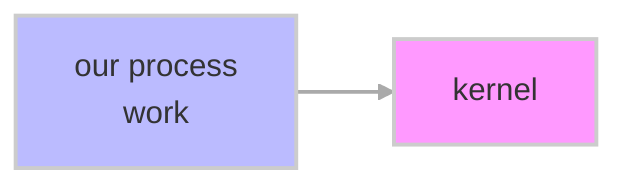
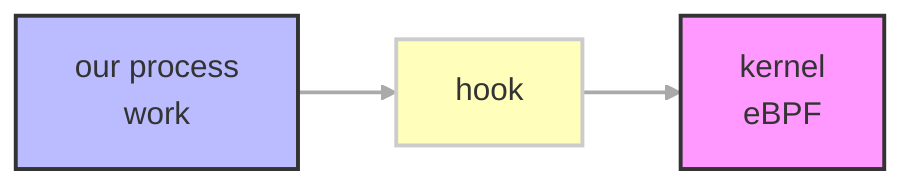
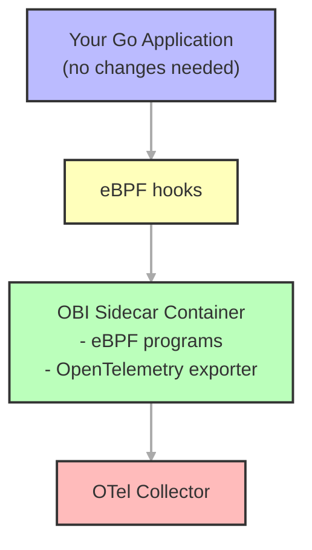
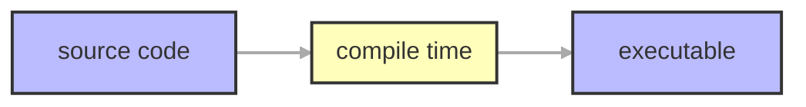
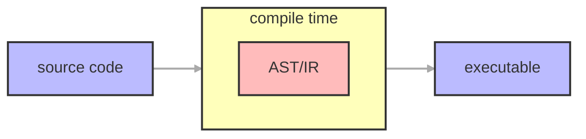
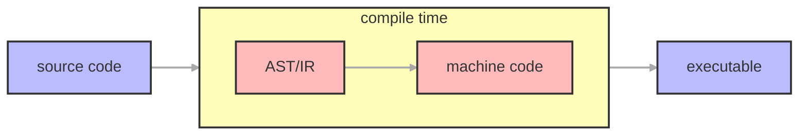
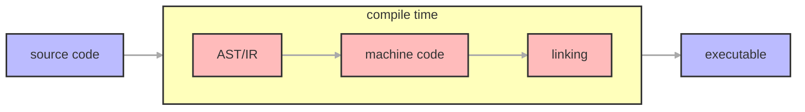

<!-- _class: vcenter invert -->

# How to Instrument Go Without Changing a Single Line of Code

Hannah Kim, Kemal Akkoyun

FOSDEM 2026

---

<!-- paginate: true -->

<!-- _class: vcenter invert -->

# WHAT IS AUTO-INSTRUMENTATION

---

<!-- _class: vcenter -->

# About Us

**Hannah Kim**

- Software Engineer at Datadog
- Working on Go observability
- GopherCon US 2025 speaker

**Kemal Akkoyun**

- Staff Engineer at Datadog
- Observability and performance tooling
- Go enthusiast

---

<!-- _class: vcenter invert -->

# What is instrumentation?

---

<!-- _class: vcenter -->

<div class="vcenter">

<div style="text-align: center;">

## your application

</div>

</div>

---

<!-- _class: vcenter -->

<div class="vcenter">

<div style="text-align: center;">

## your application → your backend

</div>

</div>

---

<!-- _class: vcenter -->

<div class="vcenter">

<div style="text-align: center;">

## your application → your backend

### ???

### ???

</div>

</div>

---

<!-- _class: vcenter -->

<div class="vcenter">

<div style="text-align: center;">

## your application → your backend

### ???

### ???

### **LOGS**

(what happened)

</div>

</div>

---

<!-- _class: vcenter -->

<div class="vcenter">

<div style="text-align: center;">

## your application → your backend

### ???

### ???

### **LOGS**

(what happened)

### **METRICS**

(how much/fast things happened)

</div>

</div>

---

<!-- _class: vcenter -->

<div class="vcenter">

<div style="text-align: center;">

## your application → your backend

### ???

### ???

### **LOGS**

(what happened)

### **METRICS**

(how much/fast things happened)

### **TRACES**

(how things happened)

</div>

</div>

---

<!-- _class: vcenter invert -->

# What is auto-instrumentation?

---

<!-- _class: vcenter -->

# What is auto-instrumentation?

1. I want to know more about my code

---

<!-- _class: vcenter -->

# What is auto-instrumentation?

1. I want to know more about my code
2. I need to instrument it, but I'm too lazy to do it myself

---

<!-- _class: vcenter -->

# What is auto-instrumentation?

1. I want to know more about my code
2. I need to instrument it, but I'm too lazy to do it myself
3. <span class="medium">INSTRUMENTATION</span>

---

<!-- _class: vcenter -->

# What is auto-instrumentation?

1. I want to know more about my code
2. I need to instrument it, but I'm too lazy to do it myself
3. ???
4. <span class="big">Profit 💸💸💸</span>

---

<!-- _class: vcenter invert -->

# What is auto-instrumentation?

---

<!-- _class: vcenter -->

# What is auto-instrumentation?

**auto-instrumentation**: instrumenting your code (getting traces + data) without manual code changes

---

<!-- _class: vcenter -->

# What is auto-instrumentation?

<div class="columns">

<div>

### RUN TIME

- Happens at runtime
- Sometimes causes source code changes
- Meh with compiler languages like Go

</div>

</div>

**auto-instrumentation**: instrumenting your code (getting traces + data) without manual code changes

---

<!-- _class: vcenter -->

# What is auto-instrumentation?

<div class="columns">

<div>

### RUN TIME

- Happens at runtime
- Sometimes causes source code changes
- Meh with compiler languages like Go

</div>

<div>

### COMPILE TIME

- Happens at... compile time
- (Before run time)
- Works great with compiler languages like Go

</div>

</div>

**auto-instrumentation**: instrumenting your code (getting traces + data) without manual code changes

---

<!-- _class: vcenter -->

# Runtime Approaches

- iovisor/gobpf
- cilium/eBPF
- OpenTelemetry Auto-Instrumentation
- OpenTelemetry eBPF Instrumentation (OBI)
- Hooking
    - Shared library injection
    - Binary trampolining

**eBPF**: extended Berkeley packet filter

---

<!-- _class: vcenter -->

# How eBPF Works

<div class="centered-mermaid">



</div>

**eBPF**: extended Berkeley packet filter

---

<!-- _class: vcenter -->

# How eBPF Works

<div class="centered-mermaid">



</div>

**eBPF**: extended Berkeley packet filter

---

<!-- _class: vcenter invert -->

# OpenTelemetry eBPF Instrumentation (OBI)

---

<!-- _class: vcenter -->

# What is OBI?

<div class="columns">

<div>

**OBI** (OpenTelemetry eBPF Instrumentation) is a runtime instrumentation approach that:

- Uses eBPF to hook into Go runtime
- Extracts telemetry without code modification
- Part of OpenTelemetry ecosystem
- Production-ready and vendor-neutral
- Requires administrative privileges (root access)

</div>
<div>
</div>
</div>

---

<!-- _class: vcenter -->

# What is OBI?

<div class="columns">

<div>

**OBI** (OpenTelemetry eBPF Instrumentation) is a runtime instrumentation approach that:

- Uses eBPF to hook into Go runtime
- Extracts telemetry without code modification
- Part of OpenTelemetry ecosystem
- Production-ready and vendor-neutral
- Requires administrative privileges (root access)

</div>
<div class="centered-mermaid">



</div>

</div>

---

<!-- _class: vcenter -->

# OBI Configuration

```yaml
# obi-config.yaml
open_port: 8080
service:
    name: fosdem-obi
log_level: debug

otel_traces_export:
    endpoint: http://otel-collector:4318

prometheus_export:
    port: 9090
    path: /metrics

meter_provider:
    features:
        - application
```

---

<!-- _class: vcenter -->

# Compile Time Approaches

<div>

- Datadog Orchestrion
- OpenTelemetry Compile Time Instrumentation SIG

</div>

---

<!-- _class: vcenter -->

# Compile Time Flow

<div class="centered-mermaid">



</div>

---

<!-- _class: vcenter -->

# Compile Time Flow

<div class="centered-mermaid">



</div>

**AST**: abstract syntax tree
**IR**: intermediate representation

---

<!-- _class: vcenter -->

# Compile Time Flow

<div class="centered-mermaid">



</div>

**AST**: abstract syntax tree
**IR**: intermediate representation

---

<!-- _class: vcenter -->

# Compile Time Flow

<div class="centered-mermaid">



</div>

**AST**: abstract syntax tree
**IR**: intermediate representation

---

<!-- _class: vcenter -->

# Compile Time Flow

<div class="centered-mermaid">


</div>

```bash
go run -toolexec 'orchestrion toolexec' .
```

**AST**: abstract syntax tree
**IR**: intermediate representation

---

<!-- _class: vcenter -->

# What is Orchestrion?

**Orchestrion** is a compile-time instrumentation approach that:

- Traces the AST created during compile time
- Injects Datadog instrumentation at specific nodes
- Updates executable file without source code changes
- Can be configured to add/remove instrumentation
- Compatible with OpenTelemetry

---

<!-- _class: vcenter -->

# Orchestrion Configuration

```yaml
# orchestrion.yaml
aspects:
    - id: make spans
      join-point:
          all-of:
              - package-name: main
              - function-body:
                    function:
                        - name: main
      advice:
          - prepend-statements:
                imports:
                    otel: go.opentelemetry.io/otel
                    context: context
                template: |-
                    tracer := otel.Tracer()
                    _, span := tracer.Start(context.Background, "orchestrion.handler")
```

---

<!-- _class: vcenter invert -->

# How do they compare?

---

<!-- _class: vcenter -->

<div class="centered-table">

| Approach           | CPU | Memory | # Errors |
| ------------------ | --- | ------ | -------- |
| Manual             |     |        |          |
| Auto (eBPF)        |     |        |          |
| Auto (OBI)         |     |        |          |
| Auto (Orchestrion) |     |        |          |

</div>

```bash
TODO(hannah): add numbers +/- to table above, add more columns as necessary
```

---

<!-- _class: vcenter invert -->

# Who wins?

---

<!-- _class: vcenter -->

# Comparison Matrix

<div class="centered-table">

| Approach           | Performance | Stability | Security | Portability |
| ------------------ | ----------- | --------- | -------- | ----------- |
| Auto (eBPF)        |             |           |          |             |
| Auto (OBI)         |             |           |          |             |
| Auto (Orchestrion) |             |           |          |             |

</div>

---

<!-- _class: vcenter -->

# Comparison Matrix

<div class="centered-table">

| Approach           | Performance | Stability | Security | Portability |
| ------------------ | ----------- | --------- | -------- | ----------- |
| Auto (eBPF)        | ⚠           |           |          |             |
| Auto (OBI)         | ⚠           |           |          |             |
| Auto (Orchestrion) | ⚠           |           |          |             |

</div>

---

<!-- _class: vcenter -->

# Comparison Matrix

<div class="centered-table">

| Approach           | Performance | Stability | Security | Portability |
| ------------------ | ----------- | --------- | -------- | ----------- |
| Auto (eBPF)        | ⚠           | ⚠         |          |             |
| Auto (OBI)         | ⚠           | ⚠         |          |             |
| Auto (Orchestrion) | ⚠           | ✅        |          |             |

</div>

---

<!-- _class: vcenter -->

# Comparison Matrix

<div class="centered-table">

| Approach           | Performance | Stability | Security | Portability |
| ------------------ | ----------- | --------- | -------- | ----------- |
| Auto (eBPF)        | ⚠           | ⚠         | ⚠        |             |
| Auto (OBI)         | ⚠           | ⚠         | ⚠        |             |
| Auto (Orchestrion) | ⚠           | ✅        | ✅       |             |

</div>

---

<!-- _class: vcenter -->

# Comparison Matrix

<div class="centered-table">

| Approach           | Performance | Stability | Security | Portability |
| ------------------ | ----------- | --------- | -------- | ----------- |
| Auto (eBPF)        | ⚠           | ⚠         | ⚠        | ⚠           |
| Auto (OBI)         | ⚠           | ⚠         | ⚠        | ⚠           |
| Auto (Orchestrion) | ⚠           | ✅        | ✅       | ✅          |

</div>

---

<!-- _class: vcenter -->

# The Winner?

<div class="centered-table">

| Approach           | Performance | Stability | Security | Portability |
| ------------------ | ----------- | --------- | -------- | ----------- |
| Auto (eBPF)        | ⚠           | ⚠         | ⚠        | ⚠           |
| Auto (OBI)         | ⚠           | ⚠         | ⚠        | ⚠           |
| Auto (Orchestrion) | ⚠           | ✅        | ✅       | ✅          |

</div>

**It depends on your use case!**

eBPF/OBI: Great for <span class="hl">runtime flexibility</span>
Orchestrion: Great for <span class="hl">stability and security</span>

---

<!-- _class: vcenter invert -->

# The future

---

<!-- _class: vcenter -->

# The future

We asked, the Go team answered...

- **golang/go#63185** – Flight recording (released in Go 1.25)

---

<!-- _class: vcenter -->

# The future

We asked, the Go team answered...

- **golang/go#63185** – Flight recording (released in Go 1.25)

Go Compile Time Instrumentation SIG

- Tuesdays 12:30-1:30PM EST

---

<!-- _class: vcenter -->

# The future

We asked, the Go team answered...

- **golang/go#63185** – Flight recording (released in Go 1.25)

Go Compile Time Instrumentation SIG

- Tuesdays 12:30-1:30PM EST

---

<!-- _class: vcenter invert -->

# Final thoughts

---

<!-- _class: vcenter -->

# Final thoughts

1. Instrumentation is helpful and important

---

<!-- _class: vcenter -->

# Final thoughts

1. Instrumentation is helpful and important
2. Auto-instrumentation is EASY

---

<!-- _class: vcenter -->

# Final thoughts

1. Instrumentation is helpful and important
2. Auto-instrumentation is EASY
3. What are YOU going to do next?

---

<!-- _class: vcenter invert -->
<!-- footer: "" -->

# Conclusion

---

<!-- _class: vcenter invert -->
<!-- footer: "" -->

<style scoped>
.columns {
    height: 100%;
    align-items: center;
}
.columns > div:first-child {
    display: flex;
    flex-direction: column;
    justify-content: center;
    align-items: flex-start;
    padding-left: 50px;
}
.contact-info {
    font-size: 0.7em;
    line-height: 1.6;
    margin-top: 20px;
}
</style>

<div class="columns">

<div>

# Thanks

<div class="contact-info">

**Hannah Kim**

- hannahkm.github.io
- linkedin.com/in/hannah-kim24/

**Kemal Akkoyun**

- @kakkoyun
- github.com/kakkoyun

</div>

</div>
<div>


</div>

</div>

---

<style scoped>
p { font-size: 0.5em; line-height: 1.4; }
</style>

# References

\[1\]
