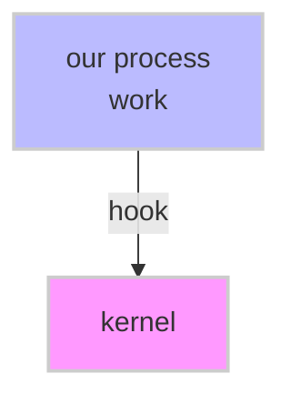
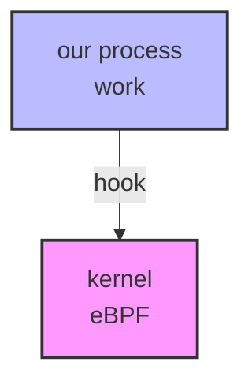
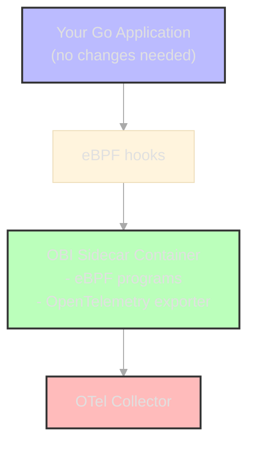

<!-- _class: vcenter invert -->

# How to Instrument Go Without Changing a Single Line of Code

Hannah S. Kim, Kemal Akkoyun

FOSDEM 2026

---

<!-- paginate: true -->

<!-- _class: vcenter invert -->

# WHAT IS AUTO-INSTRUMENTATION

---

<!-- _class: vcenter -->

# About Us

**Hannah S. Kim**

- Software Engineer at Datadog
- Working on Go observability
- GopherCon US 2025 speaker

**Kemal Akkoyun**

- Staff Engineer at Datadog
- Observability and performance tooling
- Go enthusiast

---

<!-- _class: vcenter invert -->

# What is instrumentation?

---

<!-- _class: vcenter -->

<div class="vcenter">

<div style="text-align: center;">

## your application

</div>

</div>

---

<!-- _class: vcenter -->

<div class="vcenter">

<div style="text-align: center;">

## your application → your backend

</div>

</div>

---

<!-- _class: vcenter -->

<div class="vcenter">

<div style="text-align: center;">

## your application → your backend

### ???

### ???

</div>

</div>

---

<!-- _class: vcenter -->

<div class="vcenter">

<div style="text-align: center;">

## your application → your backend

### ???

### ???

### **LOGS**

(what happened)

</div>

</div>

---

<!-- _class: vcenter -->

<div class="vcenter">

<div style="text-align: center;">

## your application → your backend

### ???

### ???

### **LOGS**

(what happened)

### **METRICS**

(how much/fast things happened)

</div>

</div>

---

<!-- _class: vcenter -->

<div class="vcenter">

<div style="text-align: center;">

## your application → your backend

### ???

### ???

### **LOGS**

(what happened)

### **METRICS**

(how much/fast things happened)

### **TRACES**

(how things happened)

</div>

</div>

---

<!-- _class: vcenter invert -->

# What is auto-instrumentation?

---

<!-- _class: vcenter -->

# What is auto-instrumentation?

1. I want to know more about my code

---

<!-- _class: vcenter -->

# What is auto-instrumentation?

1. I want to know more about my code
2. I need to instrument it, but I'm too lazy to do it myself

---

<!-- _class: vcenter -->

# What is auto-instrumentation?

1. I want to know more about my code
2. I need to instrument it, but I'm too lazy to do it myself
3. <span class="medium">INSTRUMENTATION</span>

---

<!-- _class: vcenter -->

# What is auto-instrumentation?

1. I want to know more about my code
2. I need to instrument it, but I'm too lazy to do it myself
3. ???
4. <span class="big">Profit 💸💸💸</span>

---

<!-- _class: vcenter invert -->

# What is auto-instrumentation?

---

<!-- _class: vcenter -->

# What is auto-instrumentation?

**auto-instrumentation**: instrumenting your code (getting traces + data) without manual code changes

---

<!-- _class: vcenter -->

# What is auto-instrumentation?

<div class="columns">

<div>

### RUN TIME

- Happens at runtime
- Sometimes causes source code changes
- Meh with compiler languages like Go

</div>

<div>

</div>

</div>

**auto-instrumentation**: instrumenting your code (getting traces + data) without manual code changes

---

<!-- _class: vcenter -->

# What is auto-instrumentation?

<div class="columns">

<div>

### RUN TIME

- Happens at runtime
- Sometimes causes source code changes
- Meh with compiler languages like Go

</div>

<div>

### COMPILE TIME

- Happens at... compile time
- (Before run time)
- Works great with compiler languages like Go

</div>

</div>

**auto-instrumentation**: instrumenting your code (getting traces + data) without manual code changes

---

<!-- _class: vcenter invert -->

# What is auto-instrumentation?

---

<!-- _class: vcenter -->

# Runtime Approaches

### RUN TIME

- iovisor/gobpf
- cilium/eBPF
- OpenTelemetry Auto-Instrumentation
- Hooking
    - Shared library injection
    - Binary trampolining

<span style="font-size: 0.8em;">**eBPF**: extended Berkeley packet filter</span>

---

<!-- _class: vcenter -->

# How eBPF Works



<span style="font-size: 0.8em;">**eBPF**: extended Berkeley packet filter</span>

---

<!-- _class: vcenter -->

# How eBPF Works



<span style="font-size: 0.8em;">**eBPF**: extended Berkeley packet filter</span>

---

<!-- _class: vcenter -->

# Compile Time Approaches

<div class="columns">

<div>

### COMPILE TIME

- Datadog Orchestrion
- OpenTelemetry Compile Time Instrumentation SIG

</div>

<div>

### RUN TIME

- iovisor/gobpf
- cilium/eBPF
- OpenTelemetry Auto-Instrumentation
- Hooking
    - Shared library injection
    - Binary trampolining

</div>

</div>

---

<!-- _class: vcenter -->

# Compile Time Flow

```
source code → compile time → executable
```

---

<!-- _class: vcenter -->

# Compile Time Flow

```
source code → compile time → executable
                    ↓
                 AST/IR
```

<span style="font-size: 0.8em;">**AST**: abstract syntax tree</span>
<span style="font-size: 0.8em;">**IR**: intermediate representation</span>

---

<!-- _class: vcenter -->

# Compile Time Flow

```
source code → compile time → executable
                    ↓
                 AST/IR
                    ↓
              machine code
```

<span style="font-size: 0.8em;">**AST**: abstract syntax tree</span>
<span style="font-size: 0.8em;">**IR**: intermediate representation</span>

---

<!-- _class: vcenter -->

# Compile Time Flow

```
source code → compile time → executable
                    ↓
                 AST/IR
                    ↓
              machine code
                    ↓
                 linking
```

<span style="font-size: 0.8em;">**AST**: abstract syntax tree</span>
<span style="font-size: 0.8em;">**IR**: intermediate representation</span>

---

<!-- _class: vcenter -->

# Orchestrion Example

```
source code → compile time → executable
                    ↓
                 AST/IR
                    ↓
              machine code
                    ↓
                 linking
```

```bash
go run -toolexec 'orchestrion toolexec' .
```

<span style="font-size: 0.8em;">**AST**: abstract syntax tree</span>
<span style="font-size: 0.8em;">**IR**: intermediate representation</span>

---

<!-- _class: vcenter invert -->

# OpenTelemetry eBPF Instrumentation (OBI)

---

<!-- _class: vcenter -->

# What is OBI?

**OBI** (OpenTelemetry eBPF Instrumentation) is a runtime instrumentation approach that:

- Uses eBPF to hook into Go runtime
- Extracts telemetry without code modification
- Part of OpenTelemetry ecosystem
- Production-ready and vendor-neutral

---

<!-- _class: vcenter -->

# OBI Architecture


---

<!-- _class: vcenter -->

# OBI Configuration

```yaml
# obi-config.yaml
instrumentation:
    http:
        enabled: true
        trace_headers: true
    database:
        enabled: true
        capture_queries: true

export:
    endpoint: "otel-collector:4317"
    protocol: grpc
```

---

<!-- _class: vcenter invert -->

# How do they perform?

---

<!-- _class: vcenter -->

# Check out the demo code

```go
mux := http.NewServeMux()
mux.HandleFunc("/hello", func(w http.ResponseWriter, r *http.Request) {
    handlers.HelloHandler(w, r)
})
```

```go
func POST(db *sql.DB, instrumentationType string, hasError bool) error {
    query := `INSERT INTO instrumentation_logs (instrumentation,
        error_status) VALUES ($1, $2)`
    _, err := db.Exec(query, instrumentationType, hasError)
    return err
}
```

---

<!-- _class: vcenter -->

# Load Testing Configuration

```javascript
stages: [
    // avg load-testing
    { duration: "15s", target: 100 }, // traffic ramp-up
    { duration: "30s", target: 100 }, // hold steady
    { duration: "15s", target: 0 }, // ramp-down to 0 users

    // spike-testing
    { duration: "2s", target: 1000 }, // sudden jump to 1000 users
    { duration: "2s", target: 0 }, // drop down to 0 users
];
```

---

<!-- _class: vcenter -->

# Metrics Collection

```go
type CPUStats struct {
    User   uint64 `json:"user"`
    System uint64 `json:"system"`
    Idle   uint64 `json:"idle"`
    Total  uint64 `json:"total"`
}

type MemoryStats struct {
    Total uint64 `json:"total"`
    Used  uint64 `json:"used"`
}

type UptimeStats struct {
    Milliseconds uint64 `json:"milliseconds"`
}
```

<span style="font-size: 0.7em;">github.com/mackerelio/go-osstat</span>

---

<!-- _class: vcenter -->

# Approaches Compared

<div class="centered-table">

| Approach                   | Description               |
| -------------------------- | ------------------------- |
| **No Instrumentation**     | Baseline (no telemetry)   |
| **Manual Instrumentation** | OpenTelemetry SDK         |
| **Auto (eBPF)**            | OpenTelemetry eBPF        |
| **Auto (OBI)**             | OTel eBPF Instrumentation |
| **Auto (Orchestrion)**     | Compile-time using OTel   |

</div>

---

<!-- _class: vcenter invert -->

# Who wins?

---

<!-- _class: vcenter -->

# Comparison Matrix

<div class="centered-table">

| Approach           | Performance | Stability | Security | Portability |
| ------------------ | ----------- | --------- | -------- | ----------- |
| Auto (eBPF)        |             |           |          |             |
| Auto (OBI)         |             |           |          |             |
| Auto (Orchestrion) |             |           |          |             |

</div>

---

<!-- _class: vcenter -->

# Comparison Matrix

<div class="centered-table">

| Approach           | Performance | Stability | Security | Portability |
| ------------------ | ----------- | --------- | -------- | ----------- |
| Auto (eBPF)        | ⚠           |           |          |             |
| Auto (OBI)         |             |           |          |             |
| Auto (Orchestrion) |             |           |          |             |

</div>

---

<!-- _class: vcenter -->

# Comparison Matrix

<div class="centered-table">

| Approach           | Performance | Stability | Security | Portability |
| ------------------ | ----------- | --------- | -------- | ----------- |
| Auto (eBPF)        | ⚠           | ⚠         |          |             |
| Auto (OBI)         | ⚠           |           |          |             |
| Auto (Orchestrion) |             |           |          |             |

</div>

---

<!-- _class: vcenter -->

# Comparison Matrix

<div class="centered-table">

| Approach           | Performance | Stability | Security | Portability |
| ------------------ | ----------- | --------- | -------- | ----------- |
| Auto (eBPF)        | ⚠           | ⚠         | ⚠        |             |
| Auto (OBI)         | ⚠           | ⚠         |          |             |
| Auto (Orchestrion) |             |           |          |             |

</div>

---

<!-- _class: vcenter -->

# Comparison Matrix

<div class="centered-table">

| Approach           | Performance | Stability | Security | Portability |
| ------------------ | ----------- | --------- | -------- | ----------- |
| Auto (eBPF)        | ⚠           | ⚠         | ⚠        | ✅          |
| Auto (OBI)         | ⚠           | ⚠         | ⚠        |             |
| Auto (Orchestrion) |             |           |          |             |

</div>

---

<!-- _class: vcenter -->

# Comparison Matrix

<div class="centered-table">

| Approach           | Performance | Stability | Security | Portability |
| ------------------ | ----------- | --------- | -------- | ----------- |
| Auto (eBPF)        | ⚠           | ⚠         | ⚠        | ✅          |
| Auto (OBI)         | ⚠           | ⚠         | ⚠        | ✅          |
| Auto (Orchestrion) | ⚠           |           |          |             |

</div>

---

<!-- _class: vcenter -->

# Comparison Matrix

<div class="centered-table">

| Approach           | Performance | Stability | Security | Portability |
| ------------------ | ----------- | --------- | -------- | ----------- |
| Auto (eBPF)        | ⚠           | ⚠         | ⚠        | ✅          |
| Auto (OBI)         | ⚠           | ⚠         | ⚠        | ✅          |
| Auto (Orchestrion) | ⚠           | ✅        |          |             |

</div>

---

<!-- _class: vcenter -->

# Comparison Matrix

<div class="centered-table">

| Approach           | Performance | Stability | Security | Portability |
| ------------------ | ----------- | --------- | -------- | ----------- |
| Auto (eBPF)        | ⚠           | ⚠         | ⚠        | ✅          |
| Auto (OBI)         | ⚠           | ⚠         | ⚠        | ✅          |
| Auto (Orchestrion) | ⚠           | ✅        | ⚠        |             |

</div>

---

<!-- _class: vcenter -->

# Comparison Matrix

<div class="centered-table">

| Approach           | Performance | Stability | Security | Portability |
| ------------------ | ----------- | --------- | -------- | ----------- |
| Auto (eBPF)        | ⚠           | ⚠         | ⚠        | ✅          |
| Auto (OBI)         | ⚠           | ⚠         | ⚠        | ✅          |
| Auto (Orchestrion) | ⚠           | ✅        | ⚠        | ✅          |

</div>

---

<!-- _class: vcenter -->

# The Winner?

<div class="centered-table">

| Approach           | Performance | Stability | Security | Portability |
| ------------------ | ----------- | --------- | -------- | ----------- |
| Auto (eBPF)        | ⚠           | ⚠         | ⚠        | ✅          |
| Auto (OBI)         | ⚠           | ⚠         | ⚠        | ✅          |
| Auto (Orchestrion) | ⚠           | ✅        | ⚠        | ✅          |

</div>

**It depends on your use case!**

eBPF/OBI: Great for <span class="hl">runtime flexibility</span>
Orchestrion: Great for <span class="hl">stability and security</span>

---

<!-- _class: vcenter invert -->

# The future

---

<!-- _class: vcenter -->

# The future

We asked, the Go team answered...

- **golang/go#63185** – Flight recording (released in Go 1.25)

---

<!-- _class: vcenter -->

# The future

We asked, the Go team answered...

- **golang/go#63185** – Flight recording (released in Go 1.25)

Go Compile Time Instrumentation SIG

- Tuesdays 12:30-1:30PM EST

---

<!-- _class: vcenter -->

# The future

We asked, the Go team answered...

- **golang/go#63185** – Flight recording (released in Go 1.25)

Go Compile Time Instrumentation SIG

- Tuesdays 12:30-1:30PM EST


---

<!-- _class: vcenter invert -->

# Final thoughts

---

<!-- _class: vcenter -->

# Final thoughts

1. Instrumentation is helpful and important

---

<!-- _class: vcenter -->

# Final thoughts

1. Instrumentation is helpful and important
2. Auto-instrumentation is EASY

---

<!-- _class: vcenter -->

# Final thoughts

1. Instrumentation is helpful and important
2. Auto-instrumentation is EASY
3. What are YOU going to do next?

<div style="margin-top: 30px; font-size: 0.9em;">

Start instrumenting your apps and learning more about auto-instrumentation because it's cool and wouldn't it be nice to have more data?

</div>

---

<!-- _class: vcenter invert -->
<!-- footer: "" -->

# Conclusion

---

<!-- _class: vcenter invert -->
<!-- footer: "" -->

<style scoped>
.columns {
    height: 100%;
    align-items: center;
}
.columns > div:first-child {
    display: flex;
    flex-direction: column;
    justify-content: center;
    align-items: flex-start;
    padding-left: 50px;
}
.contact-info {
    font-size: 0.7em;
    line-height: 1.6;
    margin-top: 20px;
}
</style>

<div class="columns">

<div>

# Thanks

<div class="contact-info">

**Hannah S. Kim**

- hannahkm.github.io
- linkedin.com/in/hannah-kim24/

**Kemal Akkoyun**

- @kakkoyun
- github.com/kakkoyun

</div>

</div>
<div>


</div>

</div>

---

<style scoped>
p { font-size: 0.5em; line-height: 1.4; }
</style>

# References

\[1\]
